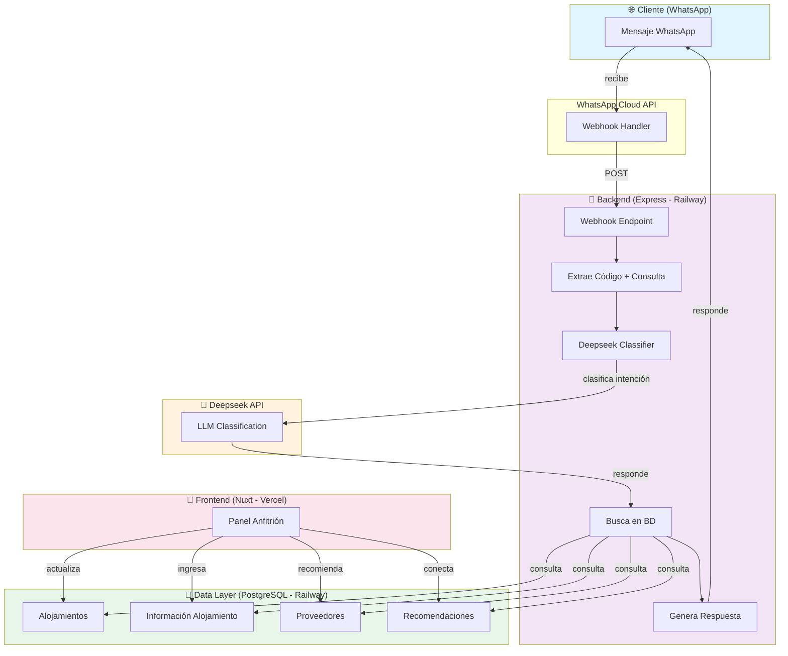
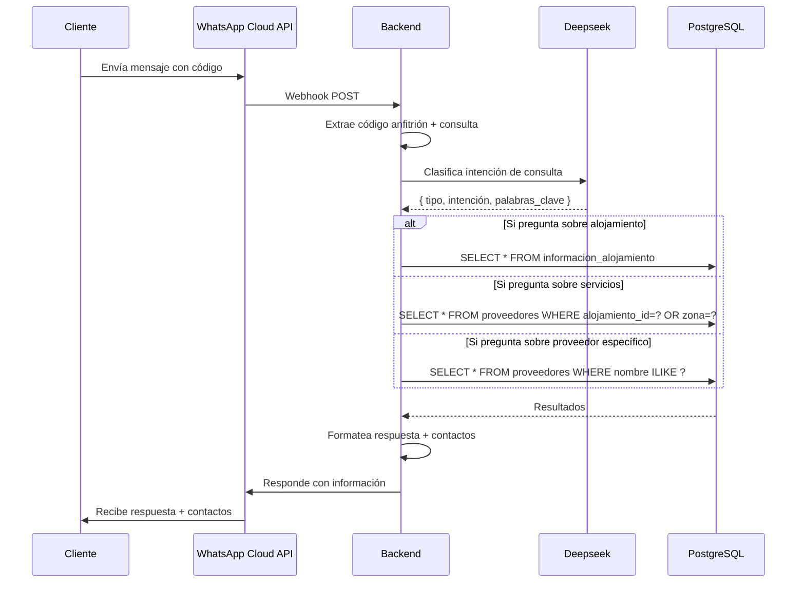
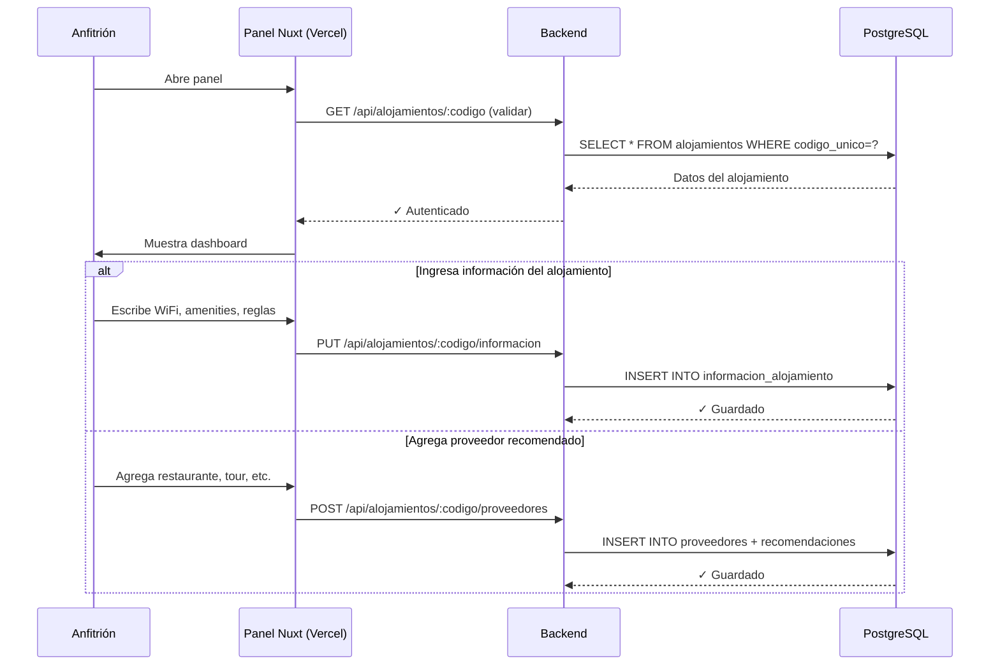
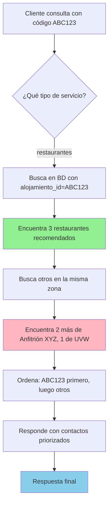
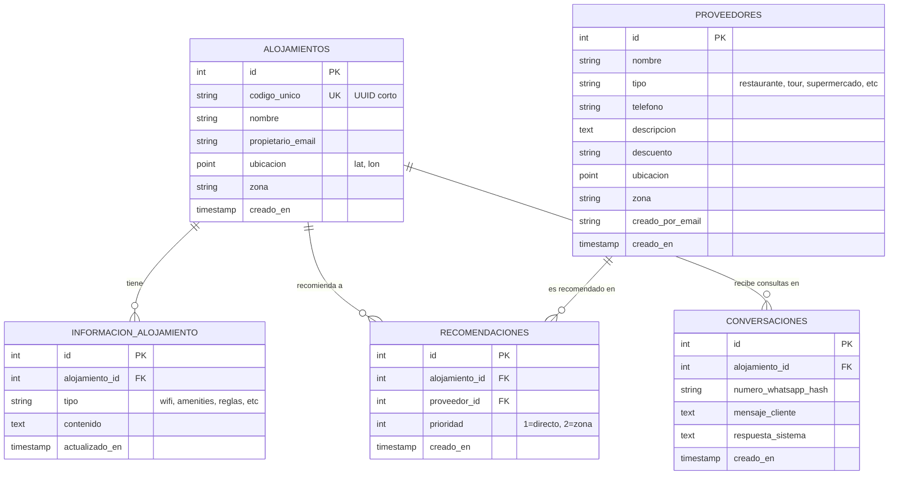
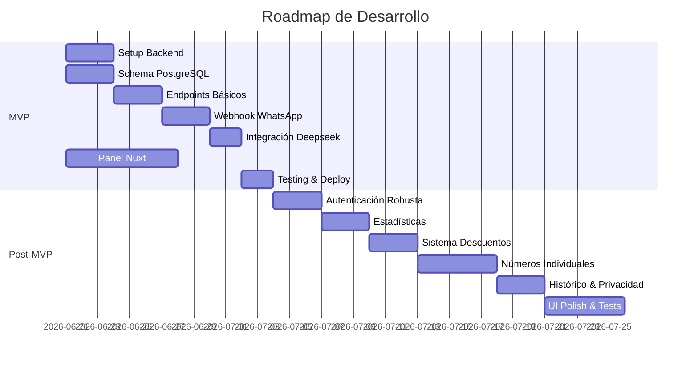
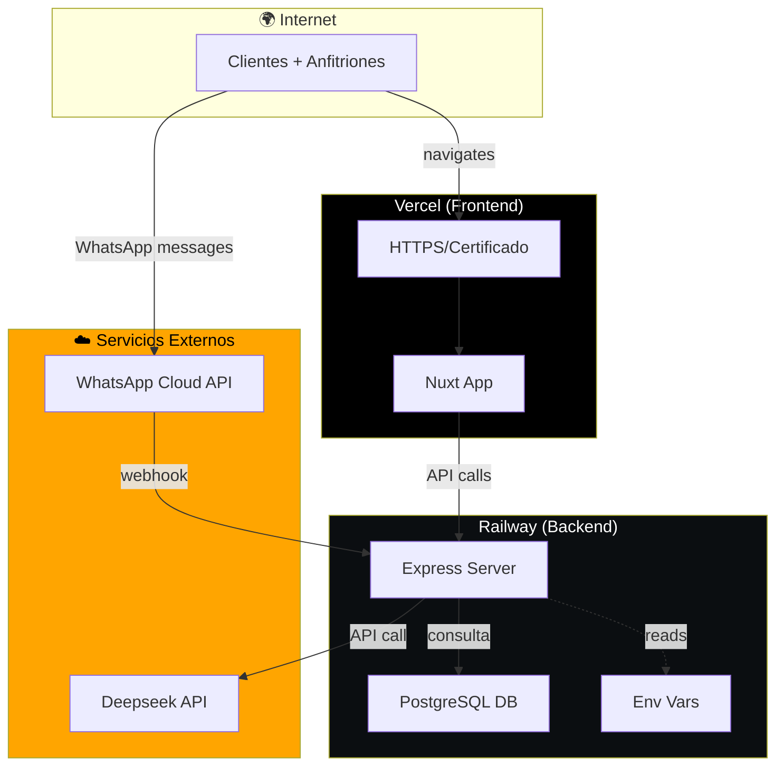

# Arquitectura - Studious Giggle

## Visión General

**Studious Giggle** es una plataforma que conecta huéspedes de Airbnb con servicios locales y información del alojamiento a través de WhatsApp. Los anfitriones comparten información sobre su propiedad y recomendaciones de proveedores; los clientes consultan por WhatsApp y obtienen respuestas automáticas 24/7 mediante un LLM.

### Problema que resuelve

- **Para el anfitrión:** Evita responder preguntas repetitivas ("¿hay WiFi?", "¿dónde como?") y delega a una plataforma automática.
- **Para el cliente:** Acceso inmediato a información del alojamiento y recomendaciones de servicios sin esperar al host.
- **Para el proveedor:** Aparece en recomendaciones sin esfuerzo; opcionalmente ofrece descuentos para aparecer en búsquedas sin recomendación directa.

---

## Stack Técnico

| Capa | Tecnología | Hosting |
|---|---|---|
| Frontend | Nuxt 3 | Vercel |
| Backend | Node.js + Express | Railway |
| Base de datos | PostgreSQL | Railway |
| LLM | Deepseek API | Cloud (Deepseek) |
| Mensajería | WhatsApp Cloud API | Cloud (Meta) |

---

## Arquitectura de Componentes



---

## Flujos Principales

### 1. Flujo de Consulta del Cliente (WhatsApp)



### 2. Flujo de Configuración del Anfitrión



### 3. Agregación de Múltiples Anfitriones



**Priorización de resultados:**
1. Recomendaciones del anfitrión actual (prioridad 1)
2. Otros proveedores en la zona (prioridad 2)
3. Descuentos (si aplica)

---

## Schema de Base de Datos

### Diagrama ER



### Tablas SQL

#### Tabla: `alojamientos`
```sql
CREATE TABLE alojamientos (
  id SERIAL PRIMARY KEY,
  codigo_unico VARCHAR(16) UNIQUE NOT NULL,
  nombre VARCHAR(255),
  descripcion TEXT,
  propietario_email VARCHAR(255),
  ubicacion POINT, -- (lat, lon) para buscar por zona
  zona VARCHAR(100), -- Ciudad/barrio
  creado_en TIMESTAMP DEFAULT NOW(),
  actualizado_en TIMESTAMP DEFAULT NOW()
);
```

### Tabla: `informacion_alojamiento`
```sql
CREATE TABLE informacion_alojamiento (
  id SERIAL PRIMARY KEY,
  alojamiento_id INTEGER NOT NULL REFERENCES alojamientos(id) ON DELETE CASCADE,
  tipo VARCHAR(100), -- "wifi", "amenities", "reglas", "checkout", etc.
  contenido TEXT, -- JSON o texto libre
  actualizado_en TIMESTAMP DEFAULT NOW()
);
```

### Tabla: `proveedores`
```sql
CREATE TABLE proveedores (
  id SERIAL PRIMARY KEY,
  nombre VARCHAR(255) NOT NULL,
  tipo VARCHAR(100), -- "restaurante", "tour", "supermercado", etc.
  telefono VARCHAR(20),
  descripcion TEXT,
  descuento VARCHAR(255), -- Ej: "10% si mencionas código XYZ"
  ubicacion POINT, -- (lat, lon)
  zona VARCHAR(100),
  creado_por_email VARCHAR(255), -- Email del proveedor si se registra
  creado_en TIMESTAMP DEFAULT NOW(),
  actualizado_en TIMESTAMP DEFAULT NOW()
);
```

### Tabla: `recomendaciones`
```sql
CREATE TABLE recomendaciones (
  id SERIAL PRIMARY KEY,
  alojamiento_id INTEGER NOT NULL REFERENCES alojamientos(id) ON DELETE CASCADE,
  proveedor_id INTEGER NOT NULL REFERENCES proveedores(id) ON DELETE CASCADE,
  prioridad INTEGER DEFAULT 1, -- 1 = recomendación directa, 2 = otra zona
  creado_en TIMESTAMP DEFAULT NOW()
);
```

### Tabla: `conversaciones` (opcional, para histórico)
```sql
CREATE TABLE conversaciones (
  id SERIAL PRIMARY KEY,
  alojamiento_id INTEGER NOT NULL REFERENCES alojamientos(id),
  numero_whatsapp VARCHAR(20), -- Hash del cliente por privacidad
  mensaje_cliente TEXT,
  respuesta_sistema TEXT,
  creado_en TIMESTAMP DEFAULT NOW()
);
```

---

## Endpoints del Backend

### Autenticación & Configuración del Anfitrión

```
POST /api/alojamientos/registrar
  Body: { email, nombre, descripcion, ubicacion, zona }
  Response: { codigo_unico, token }

GET /api/alojamientos/:codigo
  Autentica con token
  Response: { alojamiento, informacion, proveedores_recomendados }

PUT /api/alojamientos/:codigo/informacion
  Body: { tipo, contenido }
  Ej: { tipo: "wifi", contenido: "50Mbps, contraseña en la puerta" }

POST /api/alojamientos/:codigo/proveedores
  Body: { nombre, tipo, telefono, descripcion }
  Response: { proveedor_id }

DELETE /api/alojamientos/:codigo/proveedores/:proveedor_id
```

### WhatsApp Webhook

```
POST /api/whatsapp/webhook
  Body (from Meta): { messages: [...] }
  Procesa: extrae código, consulta, busca, responde

GET /api/whatsapp/webhook
  Validación de token con Meta
```

### Búsqueda/Consulta (usado por Deepseek + backend)

```
GET /api/busqueda/:codigo
  Query: { tipo, palabra_clave }
  Ej: GET /api/busqueda/ABC123?tipo=alojamiento&palabra_clave=wifi
  Response: { resultados: [...] }

GET /api/busqueda/zona/:zona
  Query: { tipo }
  Obtiene todos los proveedores de una zona (para contexto)
```

---

## Integración con Deepseek

### Flujo de Extracción de Intención

```javascript
// Backend recibe: "¿hay WiFi?"
const consulta = "¿hay WiFi?";
const codigo = "ABC123";

const respuesta = await deepseekAPI.chat({
  model: "deepseek-chat",
  messages: [
    {
      role: "system",
      content: `Eres un asistente que clasifica consultas de huéspedes.
      Extrae: intención (tipo de servicio), palabras clave, y si es sobre el alojamiento o servicios externos.
      Responde en JSON: { tipo: "alojamiento" | "servicio", intención: "...", palabras_clave: [...] }`
    },
    {
      role: "user",
      content: consulta
    }
  ]
});

// Deepseek responde: { tipo: "alojamiento", intención: "wifi", palabras_clave: ["wifi", "internet"] }
// Backend busca en DB con esa información
```

**Costos esperados:** $20 USD = ~2000-5000 consultas (muy holgado para MVP).

---

## Integración con WhatsApp Cloud API

### Setup Inicial

1. **Número de WhatsApp:** Uno único para MVP (después cada anfitrión puede tener el suyo).
2. **Webhook:** El backend expone `POST /api/whatsapp/webhook`.
3. **Token:** Guardado en variables de entorno (`WHATSAPP_TOKEN`, `WHATSAPP_PHONE_ID`).

### Recepción de Mensajes

```javascript
// POST /api/whatsapp/webhook
app.post('/api/whatsapp/webhook', (req, res) => {
  const { entry } = req.body;
  
  entry.forEach(({ changes }) => {
    changes.forEach(({ value }) => {
      const { messages } = value;
      
      messages?.forEach(msg => {
        const { from, text, id } = msg;
        const codigo = extraerCodigoDelMensaje(text.body); // Ej: "ABC123 ¿hay wifi?"
        
        procesarConsulta(codigo, text.body, from);
      });
    });
  });
  
  res.sendStatus(200); // Confirmar a Meta
});
```

### Envío de Respuestas

```javascript
async function responderPorWhatsApp(telefono, mensaje) {
  const response = await fetch('https://graph.instagram.com/v18.0/102.../messages', {
    method: 'POST',
    headers: {
      'Authorization': `Bearer ${WHATSAPP_TOKEN}`,
      'Content-Type': 'application/json'
    },
    body: JSON.stringify({
      messaging_product: 'whatsapp',
      recipient_type: 'individual',
      to: telefono,
      type: 'text',
      text: { body: mensaje }
    })
  });
}
```

---

## Panel del Anfitrión (Nuxt)

### Páginas Principales

```
/login
  └─ Ingresa código o email

/dashboard
  ├─ Resumen: código, zona, nº de proveedores
  ├─ Mi código (para compartir con clientes)
  └─ Estadísticas básicas (consultas recibidas, etc.)

/informacion
  ├─ WiFi, amenities, reglas
  ├─ Horarios de checkout, instrucciones
  └─ Guardar/editar

/proveedores
  ├─ Listado de tus recomendaciones
  ├─ Agregar nuevo proveedor
  ├─ Editar/eliminar
  └─ Ver proveedores de la zona (para agregar)

/descuentos (v2)
  └─ Ofrecer descuentos para aparecer en búsquedas
```

---

## Flujo de Desarrollo (Fases)



### MVP (Semana 1-2)
- [ ] Backend básico (Express + PostgreSQL)
- [ ] Tabla: `alojamientos`, `informacion_alojamiento`, `proveedores`, `recomendaciones`
- [ ] Endpoint: registrar anfitrión, agregar proveedores
- [ ] Webhook WhatsApp: recibir mensaje, buscar, responder
- [ ] Integración Deepseek: clasificación básica
- [ ] Panel Nuxt: login, agregar información y proveedores

### Post-MVP (Semana 3+)
- [ ] Autenticación robusta (JWT, sesiones)
- [ ] Estadísticas del anfitrión (consultas, proveedores populares)
- [ ] Sistema de descuentos
- [ ] Cada anfitrión con su número de WhatsApp
- [ ] Histórico de conversaciones (privacidad)
- [ ] UI pulida, tests

---

## Consideraciones de Seguridad & Privacidad

1. **Códigos únicos:** Imposible adivinar; usar UUID v4 acortado.
2. **Números de WhatsApp:** Hash los números de clientes en histórico.
3. **Autenticación:** JWT con expiración; refrescar con refresh token.
4. **CORS:** Restringir a dominio de Vercel.
5. **Rate limiting:** Evitar spam en WhatsApp (máx 10 consultas/min por número).

---

## Arquitectura de Deployment



## Deployment Checklist

- [ ] Vercel: conectar repo, env vars (DEEPSEEK_API_KEY, WHATSAPP_TOKEN, etc.)
- [ ] Railway: crear app Node.js + PostgreSQL
- [ ] Variables de entorno en ambos (nunca commitear secrets)
- [ ] Webhook de WhatsApp apuntando a `https://tu-backend.railway.app/api/whatsapp/webhook`
- [ ] Dominio personalizado en Vercel (opcional para MVP)
- [ ] HTTPS en todo (obligatorio para WhatsApp)

---

## Próximos Pasos

1. Revisar este documento y ajustar según feedback.
2. Crear repo en studious-giggle con estructura de carpetas.
3. Comenzar con backend y BD.
4. Luego, panel Nuxt.
5. Integración WhatsApp al final (para no romper en el proceso).
